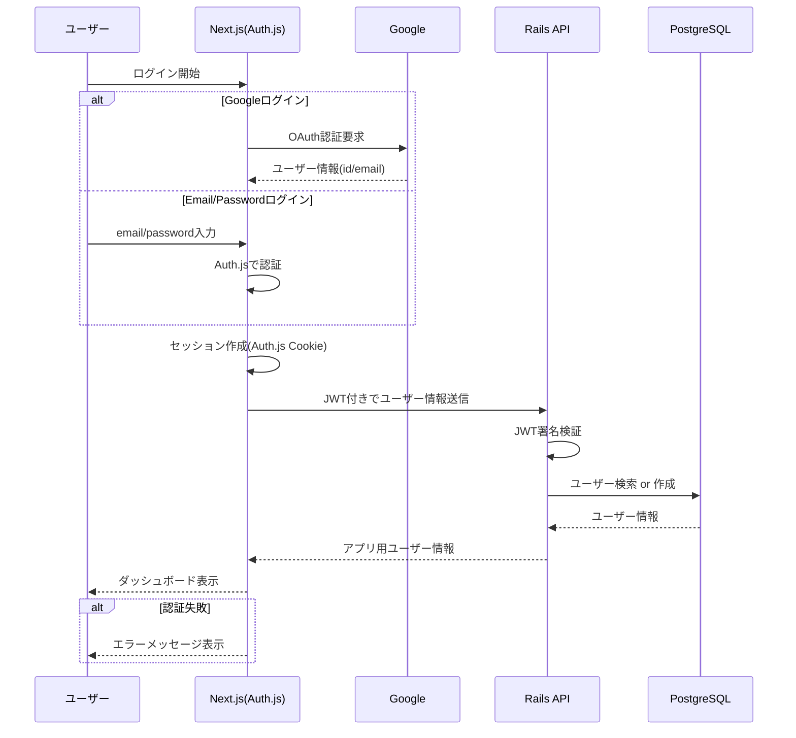
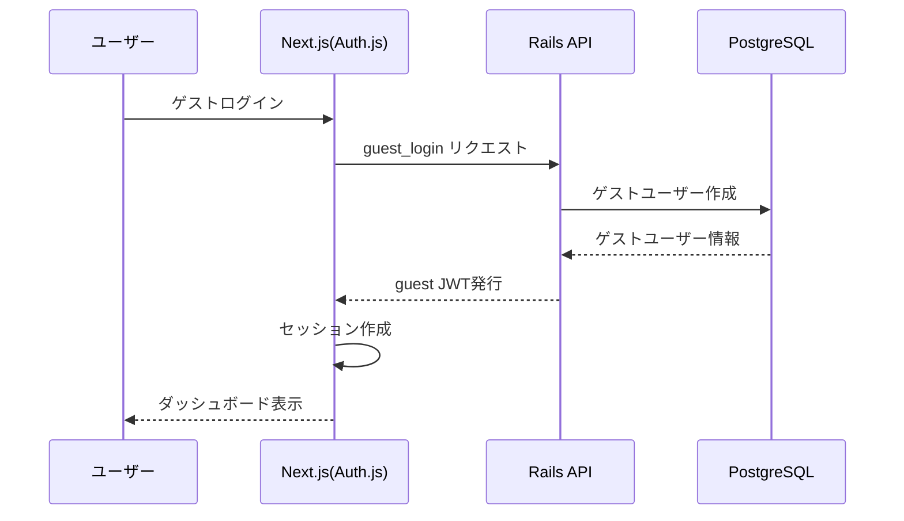

## 通常ログイン（Google / Email共通）

```mermaid
sequenceDiagram
    participant User as ユーザー
    participant Front as Next.js(Auth.js)
    participant Google as Google
    participant API as Rails API
    participant DB as PostgreSQL

    User->>Front: ログイン開始

    alt Googleログイン
        Front->>Google: OAuth認証要求
        Google-->>Front: ユーザー情報(id/email)
    else Email/Passwordログイン
        User->>Front: email/password入力
        Front->>Front: Auth.jsで認証
    end

    Front->>Front: セッション作成(Auth.js Cookie)

    Front->>API: JWT付きでユーザー情報送信
    API->>API: JWT署名検証

    API->>DB: ユーザー検索 or 作成
    DB-->>API: ユーザー情報

    API-->>Front: アプリ用ユーザー情報
    Front-->>User: ダッシュボード表示

    alt 認証失敗
        Front-->>User: エラーメッセージ表示
    end
```

## ゲストログイン

```mermaid
sequenceDiagram
    participant User as ユーザー
    participant Front as Next.js(Auth.js)
    participant API as Rails API
    participant DB as PostgreSQL

    User->>Front: ゲストログイン

    Front->>API: guest_login リクエスト
    API->>DB: ゲストユーザー作成
    DB-->>API: ゲストユーザー情報

    API-->>Front: guest JWT発行
    Front->>Front: セッション作成

    Front-->>User: ダッシュボード表示
```
