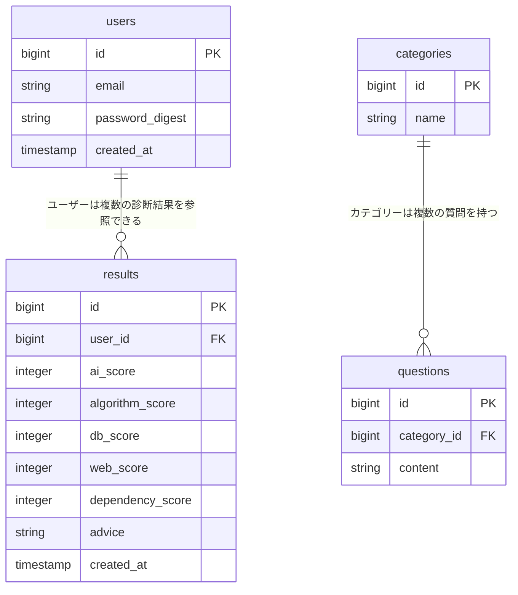

# 設計

下記設計についての要件をまとめております。

- 業務フロー：Figma
- 画面遷移図：Figma
- ワイヤーフレーム：Figma
- テーブル定義書 / ER図：Mermaid
- システム構成図：draw.io

## 業務フロー / 画面遷移図 / ワイヤーフレーム
Figmaにて作成

https://www.figma.com/design/IyTFoHXk37hss5w02hBsEs/%E7%90%86%E8%A7%A3%E8%B2%A0%E5%82%B5%E3%83%81%E3%82%A7%E3%83%83%E3%82%AB%E3%83%BC%E7%94%BB%E9%9D%A2%E9%81%B7%E7%A7%BB%E5%9B%B3?node-id=0-1&t=lUHVVgz1QZ0eWCkH-1

## テーブル定義書 / ER図
### エンティティ抽出・定義
  - users
    - email
    - password_digest
  - 技術分野
    - name
  - 質問
    - content
    - category
  - 診断結果
    - 依存度
    - スコア(AI、アルゴリズム、db、web、AI依存度)
    - アドバイス

### ER図

### テーブル定義書
テーブル：users
| カラム名 | データ型 | NULL | キー | 初期値 | AUTO INCREMENT |
| ---- | ---- | ---- | ---- | ---- | ---- |
| id | integer | NOT NULL | PRIMARY | | YES |
| email | string | NOT NULL | UNIQUE | | |
| password_digest | string | NOT NULL | | | |
| created_at | timestamp | NOT NULL | | | |
| updated_at | timestamp | NOT NULL | | | |

テーブル：categories
| カラム名 | データ型 | NULL | キー | 初期値 | AUTO INCREMENT |
| ---- | ---- | ---- | ---- | ---- | ---- |
| id | integer | NOT NULL | PRIMARY | | YES |
| name | string | NOT NULL | | | |

テーブル：questions
| カラム名 | データ型 | NULL | キー | 初期値 | AUTO INCREMENT |
| ---- | ---- | ---- | ---- | ---- | ---- |
| id | integer | NOT NULL | PRIMARY | | YES |
| category_id | integer | NOT NULL | FOREIGN | | |
| content | text | NOT NULL | | | |

テーブル：results
| カラム名 | データ型 | NULL | キー | 初期値 | AUTO INCREMENT |
| ---- | ---- | ---- | ---- | ---- | ---- |
| id | integer | NOT NULL | PRIMARY | | YES |
| user_id | integer | NOT NULL | FOREIGN | | |
| ai_score | integer | NOT NULL | | | |
| algorithm_score | integer | NOT NULL | | | |
| db_score | integer | NOT NULL | | | |
| web_score | integer | NOT NULL | | | |
| dependency_score | integer | NOT NULL | | | |
| advice | text | NOT NULL | | | |
| created_at | timestamp | NOT NULL | | | |
| updated_at | timestamp | NOT NULL | | | |

## APIドキュメント

docs/api_design.mdに記載。

## システム構成図

仮でFigmaにて作成

